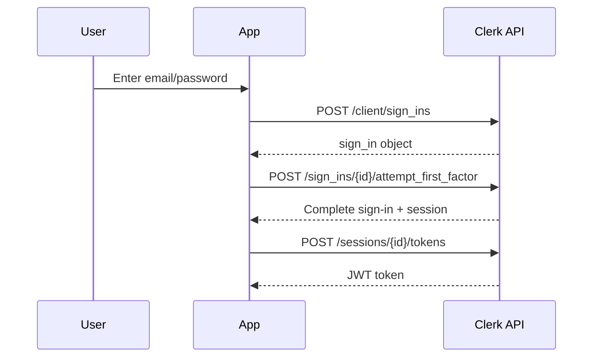
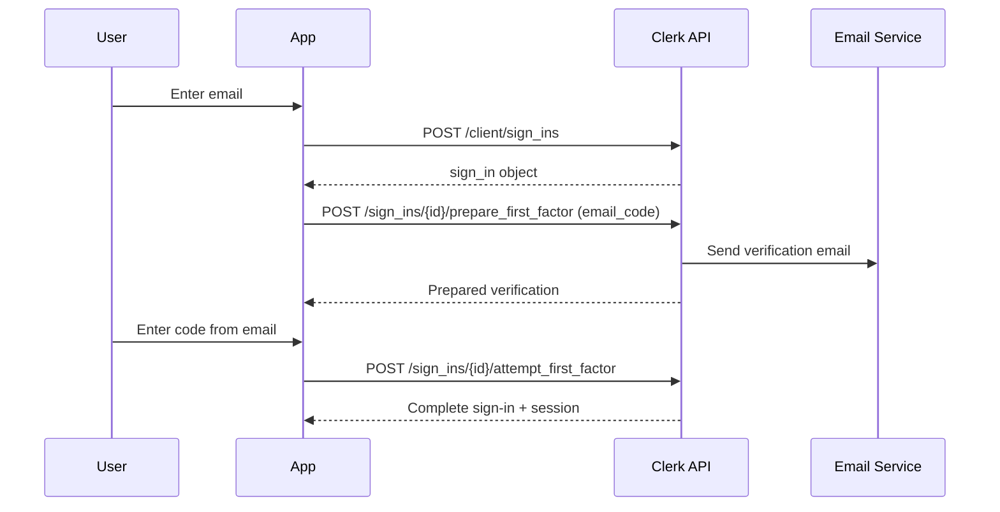
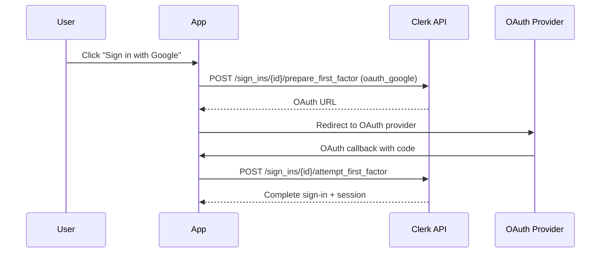

# 🔐 **Complete Clerk Authentication SDK Guide**

> **Build a full-featured authentication SDK using Clerk's REST API**  
> Version: 1.0.0 | Compatible with Clerk API Version: 2025-04-10

## **📋 Table of Contents**

- [Overview](#overview)
- [Prerequisites](#prerequisites)
- [Core Architecture](#core-architecture)
- [API Endpoints Reference](#api-endpoints-reference)
- [Authentication Flows](#authentication-flows)
- [Session Management](#session-management)
- [Token Management](#token-management)
- [Error Handling](#error-handling)
- [Advanced Features](#advanced-features)
- [Complete SDK Implementation](#complete-sdk-implementation)
- [Testing & Validation](#testing--validation)
- [Production Considerations](#production-considerations)
- [Troubleshooting](#troubleshooting)

---

## **🎯 Overview**

This guide provides everything needed to build a complete authentication SDK that replicates Clerk's functionality using only REST API calls. No official Clerk SDK required.

### **What You'll Build**
- ✅ Complete authentication flows (email, password, OAuth, WebAuthn)
- ✅ Session management with automatic refresh
- ✅ JWT token generation and validation
- ✅ Multi-session support
- ✅ Organization management
- ✅ User profile management
- ✅ Error handling and retry logic
- ✅ Cross-tab synchronization
- ✅ Offline support
- ✅ TypeScript support

---

## **🛠️ Prerequisites**

### **Required Information**
- **Domain**: Your Clerk instance domain (e.g., `bright-newt-8.clerk.accounts.dev`)
- **Publishable Key**: Not required for API calls, only for domain extraction
- **Modern Browser**: Support for `fetch()`, `localStorage`, `BroadcastChannel`

### **Browser Requirements**
```javascript
// Check browser compatibility
const isCompatible = 
  typeof fetch !== 'undefined' &&
  typeof localStorage !== 'undefined' &&
  typeof URLSearchParams !== 'undefined';
```

---

## **🏗️ Core Architecture**

### **SDK Structure**
```
ClerkSDK/
├── core/
│   ├── Client.js          # HTTP client wrapper
│   ├── Storage.js         # Local storage management
│   ├── Events.js          # Event system
│   └── Constants.js       # API constants
├── auth/
│   ├── SignIn.js          # Sign-in flows
│   ├── SignUp.js          # Sign-up flows
│   ├── Session.js         # Session management
│   └── Token.js           # JWT handling
├── resources/
│   ├── User.js            # User operations
│   ├── Organization.js    # Organization management
│   └── Environment.js     # Environment config
├── utils/
│   ├── Errors.js          # Error handling
│   ├── Validation.js      # Input validation
│   └── Helpers.js         # Utility functions
└── ClerkSDK.js           # Main SDK class
```

### **Key Design Principles**
1. **Stateless HTTP**: Every request is independent
2. **Cookie-Based Sessions**: Automatic session management
3. **Event-Driven**: Real-time state updates
4. **Error Resilient**: Comprehensive error handling
5. **TypeScript Ready**: Full type definitions

---

## **🌐 API Endpoints Reference**

### **Base Configuration**
```javascript
const API_CONFIG = {
  domain: 'bright-newt-8.clerk.accounts.dev',
  version: '2025-04-10',
  jsVersion: '5.88.0',
  baseUrl: 'https://bright-newt-8.clerk.accounts.dev/v1'
};

// Required query parameters for ALL requests
const defaultParams = {
  __clerk_api_version: API_CONFIG.version,
  _clerk_js_version: API_CONFIG.jsVersion
};
```

### **1. Environment & Client**

| Endpoint | Method | Purpose | Auth Required |
|----------|--------|---------|---------------|
| `/environment` | GET | Get app configuration | No |
| `/client` | PUT | Create client session | No |
| `/client` | GET | Get current client state | No |
| `/client` | DELETE | Destroy client | No |
| `/client/touch` | GET | Extend client cookie | No |

### **2. Authentication**

| Endpoint | Method | Purpose | Auth Required |
|----------|--------|---------|---------------|
| `/client/sign_ins` | POST | Create sign-in attempt | No |
| `/client/sign_ins/{id}/prepare_first_factor` | POST | Prepare verification | No |
| `/client/sign_ins/{id}/attempt_first_factor` | POST | Submit verification | No |
| `/client/sign_ins/{id}/prepare_second_factor` | POST | Prepare 2FA | Yes |
| `/client/sign_ins/{id}/attempt_second_factor` | POST | Submit 2FA | Yes |
| `/client/sign_ups` | POST | Create sign-up attempt | No |
| `/client/sign_ups/{id}/prepare_verification` | POST | Prepare email/phone verification | No |
| `/client/sign_ups/{id}/attempt_verification` | POST | Submit verification code | No |

### **3. Session Management**

| Endpoint | Method | Purpose | Auth Required |
|----------|--------|---------|---------------|
| `/client/sessions` | GET | List all sessions | Yes |
| `/client/sessions/{id}` | GET | Get session details | Yes |
| `/client/sessions/{id}` | DELETE | Sign out session | Yes |
| `/client/sessions` | DELETE | Sign out all sessions | Yes |
| `/client/sessions/{id}/touch` | POST | Extend session | Yes |
| `/client/sessions/{id}/tokens` | POST | Generate JWT token | Yes |
| `/client/sessions/{id}/verify` | POST | Verify session | Yes |

### **4. User Management**

| Endpoint | Method | Purpose | Auth Required |
|----------|--------|---------|---------------|
| `/me` | GET | Get current user | Yes |
| `/me` | PATCH | Update user profile | Yes |
| `/me/email_addresses` | POST | Add email address | Yes |
| `/me/email_addresses/{id}` | DELETE | Remove email address | Yes |
| `/me/phone_numbers` | POST | Add phone number | Yes |
| `/me/phone_numbers/{id}` | DELETE | Remove phone number | Yes |
| `/me/passwords` | POST | Change password | Yes |
| `/me/profile_image` | PUT | Update profile image | Yes |

### **5. Organization Management**

| Endpoint | Method | Purpose | Auth Required |
|----------|--------|---------|---------------|
| `/organizations` | GET | List user organizations | Yes |
| `/organizations` | POST | Create organization | Yes |
| `/organizations/{id}` | GET | Get organization details | Yes |
| `/organizations/{id}` | PATCH | Update organization | Yes |
| `/organizations/{id}` | DELETE | Delete organization | Yes |
| `/organizations/{id}/memberships` | GET | List members | Yes |
| `/organizations/{id}/memberships` | POST | Invite member | Yes |
| `/organizations/{id}/memberships/{id}` | DELETE | Remove member | Yes |

---

## **🔄 Authentication Flows**

### **1. Email + Password Flow**



### **2. Email Code Flow**



### **3. OAuth Flow**



---

## **💾 Session Management**

### **Session Lifecycle**

```javascript
class SessionManager {
  constructor(apiClient) {
    this.client = apiClient;
    this.currentSession = null;
    this.refreshTimer = null;
  }

  async createSession(signInResult) {
    if (signInResult.status === 'complete') {
      this.currentSession = {
        id: signInResult.created_session_id,
        user: signInResult.user_data,
        expiresAt: new Date(Date.now() + 7 * 24 * 60 * 60 * 1000), // 7 days default
        lastActiveAt: new Date()
      };
      
      this.startRefreshTimer();
      return this.currentSession;
    }
    return null;
  }

  async getCurrentSession() {
    try {
      const { data } = await this.client.get('/client');
      const activeSessions = data.response.sessions.filter(s => s.status === 'active');
      const currentSession = activeSessions.find(s => s.id === data.response.last_active_session_id);
      
      return currentSession || null;
    } catch (error) {
      console.error('Failed to get current session:', error);
      return null;
    }
  }

  async validateSession(sessionId) {
    try {
      const { data } = await this.client.get(`/client/sessions/${sessionId}`, {
        params: { _clerk_session_id: sessionId }
      });
      
      const session = data.response;
      const isValid = session.status === 'active' && new Date(session.expire_at) > new Date();
      
      return { isValid, session };
    } catch (error) {
      return { isValid: false, error };
    }
  }

  async refreshSession(sessionId) {
    try {
      await this.client.post(`/client/sessions/${sessionId}/touch`, {}, {
        params: { _clerk_session_id: sessionId }
      });
      return true;
    } catch (error) {
      console.error('Failed to refresh session:', error);
      return false;
    }
  }

  startRefreshTimer() {
    // Refresh session every 5 minutes
    this.refreshTimer = setInterval(async () => {
      if (this.currentSession) {
        await this.refreshSession(this.currentSession.id);
      }
    }, 5 * 60 * 1000);
  }

  stopRefreshTimer() {
    if (this.refreshTimer) {
      clearInterval(this.refreshTimer);
      this.refreshTimer = null;
    }
  }

  async signOut(sessionId = this.currentSession?.id) {
    if (!sessionId) return;
    
    try {
      await this.client.delete(`/client/sessions/${sessionId}`, {
        params: { _clerk_session_id: sessionId }
      });
      
      this.currentSession = null;
      this.stopRefreshTimer();
      return true;
    } catch (error) {
      console.error('Failed to sign out:', error);
      return false;
    }
  }
}
```

---

## **🎫 Token Management**

### **JWT Token Handler**

```javascript
class TokenManager {
  constructor(apiClient) {
    this.client = apiClient;
    this.tokenCache = new Map();
  }

  async getToken(sessionId, template = '', options = {}) {
    const cacheKey = `${sessionId}-${template}`;
    const cached = this.tokenCache.get(cacheKey);
    
    // Return cached token if still valid (expires in 1 hour by default)
    if (cached && cached.expiresAt > new Date()) {
      return cached.jwt;
    }

    try {
      const { data } = await this.client.post(`/client/sessions/${sessionId}/tokens`, 
        new URLSearchParams({ template }), 
        {
          headers: { 'Content-Type': 'application/x-www-form-urlencoded' },
          params: { _clerk_session_id: sessionId }
        }
      );

      const jwt = data.response.jwt;
      const decoded = this.decodeJWT(jwt);
      
      // Cache the token
      this.tokenCache.set(cacheKey, {
        jwt,
        expiresAt: new Date(decoded.exp * 1000),
        issuedAt: new Date(decoded.iat * 1000)
      });

      return jwt;
    } catch (error) {
      console.error('Failed to get token:', error);
      throw error;
    }
  }

  decodeJWT(token) {
    try {
      const parts = token.split('.');
      const payload = JSON.parse(atob(parts[1]));
      return payload;
    } catch (error) {
      throw new Error('Invalid JWT token');
    }
  }

  isTokenExpired(token) {
    try {
      const decoded = this.decodeJWT(token);
      return decoded.exp * 1000 <= Date.now();
    } catch (error) {
      return true;
    }
  }

  clearTokenCache(sessionId = null) {
    if (sessionId) {
      // Clear tokens for specific session
      for (const [key] of this.tokenCache.entries()) {
        if (key.startsWith(sessionId)) {
          this.tokenCache.delete(key);
        }
      }
    } else {
      // Clear all tokens
      this.tokenCache.clear();
    }
  }

  // Get token for third-party integrations
  async getCustomToken(sessionId, templateName) {
    return this.getToken(sessionId, templateName);
  }

  // Validate token without making API call
  validateTokenLocally(token) {
    try {
      const decoded = this.decodeJWT(token);
      const now = Date.now() / 1000;
      
      return {
        isValid: decoded.exp > now && decoded.iat <= now,
        payload: decoded,
        expiresAt: new Date(decoded.exp * 1000),
        issuedAt: new Date(decoded.iat * 1000)
      };
    } catch (error) {
      return { isValid: false, error: error.message };
    }
  }
}
```

---

## **⚠️ Error Handling**

### **Comprehensive Error System**

```javascript
class ClerkError extends Error {
  constructor(message, code, status, errors = []) {
    super(message);
    this.name = 'ClerkError';
    this.code = code;
    this.status = status;
    this.errors = errors;
    this.timestamp = new Date();
  }
}

class ErrorHandler {
  static handle(error, context = '') {
    console.error(`[${context}] Clerk Error:`, error);
    
    if (error.response) {
      const { status, data } = error.response;
      const errors = data.errors || [];
      const primaryError = errors[0] || {};
      
      return new ClerkError(
        primaryError.long_message || primaryError.message || 'Unknown error',
        primaryError.code || 'unknown_error',
        status,
        errors
      );
    }
    
    return new ClerkError(error.message, 'network_error', 0);
  }

  static isRetryable(error) {
    // Retry on network errors and 5xx server errors
    return error.code === 'network_error' || (error.status >= 500 && error.status < 600);
  }

  static getRetryDelay(attemptNumber) {
    // Exponential backoff: 1s, 2s, 4s, 8s, 16s
    return Math.min(1000 * Math.pow(2, attemptNumber - 1), 16000);
  }
}

// Retry mechanism
class RetryHandler {
  static async withRetry(fn, maxAttempts = 3, context = '') {
    let lastError;
    
    for (let attempt = 1; attempt <= maxAttempts; attempt++) {
      try {
        return await fn();
      } catch (error) {
        lastError = ErrorHandler.handle(error, context);
        
        if (attempt === maxAttempts || !ErrorHandler.isRetryable(lastError)) {
          throw lastError;
        }
        
        const delay = ErrorHandler.getRetryDelay(attempt);
        console.warn(`Attempt ${attempt} failed, retrying in ${delay}ms...`);
        await new Promise(resolve => setTimeout(resolve, delay));
      }
    }
    
    throw lastError;
  }
}
```

### **Common Error Codes**

```javascript
const ERROR_CODES = {
  // Authentication Errors
  FORM_IDENTIFIER_NOT_FOUND: 'form_identifier_not_found',
  FORM_PASSWORD_INCORRECT: 'form_password_incorrect', 
  FORM_CODE_INCORRECT: 'form_code_incorrect',
  SESSION_TOKEN_INVALID: 'session_token_invalid',
  SESSION_TOKEN_EXPIRED: 'session_token_expired',
  
  // Rate Limiting
  RATE_LIMIT_EXCEEDED: 'rate_limit_exceeded',
  
  // Network & Infrastructure
  NETWORK_ERROR: 'network_error',
  SERVER_ERROR: 'server_error',
  
  // Validation Errors
  FORM_PARAM_MISSING: 'form_param_missing',
  FORM_PARAM_INVALID: 'form_param_invalid',
  
  // Permission Errors
  NOT_ALLOWED_ACCESS: 'not_allowed_access',
  INSUFFICIENT_PERMISSIONS: 'insufficient_permissions'
};
```

---

## **🚀 Advanced Features**

### **1. Multi-Tab Synchronization**

```javascript
class TabSynchronizer {
  constructor(clerkSDK) {
    this.sdk = clerkSDK;
    this.channel = new BroadcastChannel('clerk-auth');
    this.setupListeners();
  }

  setupListeners() {
    this.channel.addEventListener('message', (event) => {
      const { type, data } = event.data;
      
      switch (type) {
        case 'SESSION_CREATED':
          this.sdk.handleExternalSessionCreated(data.session);
          break;
        case 'SESSION_DESTROYED':
          this.sdk.handleExternalSessionDestroyed(data.sessionId);
          break;
        case 'USER_UPDATED':
          this.sdk.handleExternalUserUpdated(data.user);
          break;
      }
    });

    // Listen for tab close
    window.addEventListener('beforeunload', () => {
      this.channel.close();
    });
  }

  broadcast(type, data) {
    this.channel.postMessage({ type, data, timestamp: Date.now() });
  }

  // Broadcast authentication events
  onSessionCreated(session) {
    this.broadcast('SESSION_CREATED', { session });
  }

  onSessionDestroyed(sessionId) {
    this.broadcast('SESSION_DESTROYED', { sessionId });
  }

  onUserUpdated(user) {
    this.broadcast('USER_UPDATED', { user });
  }
}
```

### **2. Offline Support**

```javascript
class OfflineManager {
  constructor(storage) {
    this.storage = storage;
    this.isOnline = navigator.onLine;
    this.pendingRequests = [];
    
    this.setupListeners();
  }

  setupListeners() {
    window.addEventListener('online', () => {
      this.isOnline = true;
      this.processPendingRequests();
    });

    window.addEventListener('offline', () => {
      this.isOnline = false;
    });
  }

  async cacheSession(session) {
    await this.storage.setItem('clerk_session_cache', JSON.stringify({
      session,
      timestamp: Date.now()
    }));
  }

  async getCachedSession() {
    try {
      const cached = await this.storage.getItem('clerk_session_cache');
      if (!cached) return null;

      const { session, timestamp } = JSON.parse(cached);
      
      // Cache valid for 1 hour offline
      if (Date.now() - timestamp > 60 * 60 * 1000) {
        return null;
      }

      return session;
    } catch (error) {
      return null;
    }
  }

  queueRequest(request) {
    this.pendingRequests.push({
      ...request,
      timestamp: Date.now()
    });
  }

  async processPendingRequests() {
    const requests = [...this.pendingRequests];
    this.pendingRequests = [];

    for (const request of requests) {
      try {
        await request.execute();
      } catch (error) {
        console.error('Failed to execute pending request:', error);
      }
    }
  }
}
```

### **3. WebAuthn/Passkey Support**

```javascript
class WebAuthnManager {
  constructor(apiClient) {
    this.client = apiClient;
  }

  isSupported() {
    return 'credentials' in navigator && 'create' in navigator.credentials;
  }

  async authenticateWithPasskey(signInId) {
    if (!this.isSupported()) {
      throw new Error('WebAuthn not supported');
    }

    try {
      // Prepare passkey challenge
      const { data } = await this.client.post(`/client/sign_ins/${signInId}/prepare_first_factor`, 
        new URLSearchParams({ strategy: 'passkey' })
      );

      const challenge = data.response.first_factor_verification.external_verification_redirect_url;
      
      // Create credential request options
      const publicKeyOptions = JSON.parse(challenge);
      
      // Get credential from authenticator
      const credential = await navigator.credentials.get({
        publicKey: publicKeyOptions
      });

      if (!credential) {
        throw new Error('No credential received');
      }

      // Attempt authentication with credential
      const response = await this.client.post(`/client/sign_ins/${signInId}/attempt_first_factor`, 
        new URLSearchParams({
          strategy: 'passkey',
          publicKeyCredential: JSON.stringify(this.serializeCredential(credential))
        })
      );

      return response.data.response;
    } catch (error) {
      console.error('WebAuthn authentication failed:', error);
      throw error;
    }
  }

  serializeCredential(credential) {
    return {
      id: credential.id,
      rawId: this.arrayBufferToBase64(credential.rawId),
      response: {
        authenticatorData: this.arrayBufferToBase64(credential.response.authenticatorData),
        clientDataJSON: this.arrayBufferToBase64(credential.response.clientDataJSON),
        signature: this.arrayBufferToBase64(credential.response.signature),
        userHandle: credential.response.userHandle ? this.arrayBufferToBase64(credential.response.userHandle) : null
      },
      type: credential.type
    };
  }

  arrayBufferToBase64(buffer) {
    const bytes = new Uint8Array(buffer);
    let binary = '';
    for (let i = 0; i < bytes.byteLength; i++) {
      binary += String.fromCharCode(bytes[i]);
    }
    return btoa(binary);
  }
}
```

### **4. Organization Management**

```javascript
class OrganizationManager {
  constructor(apiClient, sessionManager) {
    this.client = apiClient;
    this.sessionManager = sessionManager;
  }

  async createOrganization(name, slug) {
    const session = await this.sessionManager.getCurrentSession();
    if (!session) throw new Error('Authentication required');

    try {
      const { data } = await this.client.post('/organizations', 
        new URLSearchParams({ name, slug }),
        {
          headers: { 'Content-Type': 'application/x-www-form-urlencoded' },
          params: { _clerk_session_id: session.id }
        }
      );

      return data.response;
    } catch (error) {
      throw ErrorHandler.handle(error, 'createOrganization');
    }
  }

  async listOrganizations() {
    const session = await this.sessionManager.getCurrentSession();
    if (!session) throw new Error('Authentication required');

    try {
      const { data } = await this.client.get('/organizations', {
        params: { _clerk_session_id: session.id }
      });

      return data.response;
    } catch (error) {
      throw ErrorHandler.handle(error, 'listOrganizations');
    }
  }

  async switchOrganization(organizationId) {
    const session = await this.sessionManager.getCurrentSession();
    if (!session) throw new Error('Authentication required');

    try {
      const { data } = await this.client.post(`/organizations/${organizationId}/memberships/${session.user.id}`, 
        new URLSearchParams({ role: 'active' }),
        {
          headers: { 'Content-Type': 'application/x-www-form-urlencoded' },
          params: { _clerk_session_id: session.id }
        }
      );

      return data.response;
    } catch (error) {
      throw ErrorHandler.handle(error, 'switchOrganization');
    }
  }

  async inviteMember(organizationId, emailAddress, role = 'basic_member') {
    const session = await this.sessionManager.getCurrentSession();
    if (!session) throw new Error('Authentication required');

    try {
      const { data } = await this.client.post(`/organizations/${organizationId}/invitations`,
        new URLSearchParams({ 
          email_address: emailAddress,
          role: role
        }),
        {
          headers: { 'Content-Type': 'application/x-www-form-urlencoded' },
          params: { _clerk_session_id: session.id }
        }
      );

      return data.response;
    } catch (error) {
      throw ErrorHandler.handle(error, 'inviteMember');
    }
  }
}
```

---

## **🔧 Complete SDK Implementation**

```javascript
class ClerkSDK {
  constructor(options = {}) {
    this.domain = options.domain || 'bright-newt-8.clerk.accounts.dev';
    this.apiVersion = options.apiVersion || '2025-04-10';
    this.jsVersion = options.jsVersion || '5.88.0';
    
    // Initialize core components
    this.client = new APIClient(this.domain, this.apiVersion, this.jsVersion);
    this.storage = new StorageManager();
    this.events = new EventEmitter();
    this.tabSync = new TabSynchronizer(this);
    this.offline = new OfflineManager(this.storage);
    
    // Initialize managers
    this.sessionManager = new SessionManager(this.client);
    this.tokenManager = new TokenManager(this.client);
    this.webAuthn = new WebAuthnManager(this.client);
    this.organizations = new OrganizationManager(this.client, this.sessionManager);
    
    // Current state
    this.user = null;
    this.session = null;
    this.organization = null;
    this.environment = null;
    this.client_state = null;
    
    this.loaded = false;
  }

  // Initialization
  async load() {
    if (this.loaded) return;

    try {
      // Initialize environment and client
      const [environment, client] = await Promise.all([
        this.fetchEnvironment(),
        this.createClient()
      ]);

      this.environment = environment;
      this.client_state = client;

      // Try to restore session from cache
      await this.restoreSession();

      this.loaded = true;
      this.events.emit('loaded', { 
        environment: this.environment, 
        client: this.client_state 
      });

    } catch (error) {
      this.events.emit('error', ErrorHandler.handle(error, 'load'));
      throw error;
    }
  }

  async fetchEnvironment() {
    const { data } = await this.client.get('/environment');
    return data.response;
  }

  async createClient() {
    const { data } = await this.client.put('/client', null, {
      headers: { 'Content-Type': 'application/x-www-form-urlencoded' }
    });
    return data.response;
  }

  async restoreSession() {
    try {
      const clientState = await this.client.get('/client');
      const activeSessions = clientState.data.response.sessions.filter(s => s.status === 'active');
      
      if (activeSessions.length > 0) {
        const currentSession = activeSessions.find(s => 
          s.id === clientState.data.response.last_active_session_id
        ) || activeSessions[0];

        this.setSession(currentSession);
      }
    } catch (error) {
      // Session restoration failed - user needs to sign in
      console.warn('Failed to restore session:', error.message);
    }
  }

  // Authentication Methods
  async signIn() {
    return new SignInFlow(this);
  }

  async signUp() {
    return new SignUpFlow(this);
  }

  async signOut(options = {}) {
    const { sessionId, signOutCallback } = options;
    const targetSessionId = sessionId || this.session?.id;

    if (!targetSessionId) return;

    try {
      await this.sessionManager.signOut(targetSessionId);
      
      if (targetSessionId === this.session?.id) {
        this.clearSession();
      }

      this.tabSync.onSessionDestroyed(targetSessionId);
      
      if (signOutCallback) {
        await signOutCallback();
      }

      this.events.emit('sessionDestroyed', { sessionId: targetSessionId });
    } catch (error) {
      throw ErrorHandler.handle(error, 'signOut');
    }
  }

  // Session Management
  setSession(session) {
    this.session = session;
    this.user = session.user;
    this.organization = session.organization || null;
    
    this.offline.cacheSession(session);
    this.events.emit('sessionCreated', { session });
    this.tabSync.onSessionCreated(session);
  }

  clearSession() {
    this.session = null;
    this.user = null;
    this.organization = null;
    
    this.tokenManager.clearTokenCache();
    this.sessionManager.stopRefreshTimer();
    this.storage.removeItem('clerk_session_cache');
  }

  // Token Methods
  async getToken(options = {}) {
    if (!this.session) {
      throw new Error('No active session');
    }

    const { template = '' } = options;
    return this.tokenManager.getToken(this.session.id, template);
  }

  // State Getters
  get isSignedIn() {
    return !!this.session && this.session.status === 'active';
  }

  get isLoaded() {
    return this.loaded;
  }

  // Event Methods
  addListener(event, callback) {
    this.events.on(event, callback);
    return () => this.events.off(event, callback);
  }

  // External session handling (from other tabs)
  handleExternalSessionCreated(session) {
    this.setSession(session);
  }

  handleExternalSessionDestroyed(sessionId) {
    if (this.session?.id === sessionId) {
      this.clearSession();
    }
  }

  handleExternalUserUpdated(user) {
    if (this.user?.id === user.id) {
      this.user = user;
      if (this.session) {
        this.session.user = user;
      }
      this.events.emit('userUpdated', { user });
    }
  }
}

// Sign-in flow implementation
class SignInFlow {
  constructor(sdk) {
    this.sdk = sdk;
    this.signInAttempt = null;
  }

  async create(params) {
    const { identifier } = params;
    
    try {
      const { data } = await this.sdk.client.post('/client/sign_ins',
        new URLSearchParams({ identifier }),
        {
          headers: { 'Content-Type': 'application/x-www-form-urlencoded' }
        }
      );

      this.signInAttempt = data.response;
      return this.signInAttempt;
    } catch (error) {
      throw ErrorHandler.handle(error, 'signIn.create');
    }
  }

  async prepareFirstFactor(params) {
    if (!this.signInAttempt) {
      throw new Error('Must create sign-in attempt first');
    }

    const { strategy } = params;
    const body = new URLSearchParams({ strategy, ...params });
    delete body.strategy; // Remove duplicate

    try {
      const { data } = await this.sdk.client.post(
        `/client/sign_ins/${this.signInAttempt.id}/prepare_first_factor`,
        body,
        {
          headers: { 'Content-Type': 'application/x-www-form-urlencoded' }
        }
      );

      this.signInAttempt = data.response;
      return this.signInAttempt;
    } catch (error) {
      throw ErrorHandler.handle(error, 'signIn.prepareFirstFactor');
    }
  }

  async attemptFirstFactor(params) {
    if (!this.signInAttempt) {
      throw new Error('Must create sign-in attempt first');
    }

    const { strategy } = params;
    const body = new URLSearchParams({ strategy, ...params });

    try {
      const { data } = await this.sdk.client.post(
        `/client/sign_ins/${this.signInAttempt.id}/attempt_first_factor`,
        body,
        {
          headers: { 'Content-Type': 'application/x-www-form-urlencoded' }
        }
      );

      this.signInAttempt = data.response;

      // If sign-in is complete, set the session
      if (this.signInAttempt.status === 'complete') {
        const session = data.client.sessions.find(s => 
          s.id === this.signInAttempt.created_session_id
        );
        if (session) {
          this.sdk.setSession(session);
        }
      }

      return this.signInAttempt;
    } catch (error) {
      throw ErrorHandler.handle(error, 'signIn.attemptFirstFactor');
    }
  }

  // Convenience methods
  async authenticateWithPassword(identifier, password) {
    await this.create({ identifier });
    return this.attemptFirstFactor({ strategy: 'password', password });
  }

  async authenticateWithCode(identifier, code) {
    await this.create({ identifier });
    
    // Find email code factor
    const emailFactor = this.signInAttempt.supported_first_factors?.find(
      f => f.strategy === 'email_code'
    );
    
    if (emailFactor) {
      await this.prepareFirstFactor({
        strategy: 'email_code',
        email_address_id: emailFactor.email_address_id
      });
    }
    
    return this.attemptFirstFactor({ strategy: 'email_code', code });
  }

  async authenticateWithPasskey() {
    if (!this.sdk.webAuthn.isSupported()) {
      throw new Error('WebAuthn not supported');
    }

    await this.create({ identifier: '' }); // Passkey doesn't need identifier
    return this.sdk.webAuthn.authenticateWithPasskey(this.signInAttempt.id);
  }
}

// Usage Example
const clerk = new ClerkSDK({
  domain: 'bright-newt-8.clerk.accounts.dev'
});

// Initialize
await clerk.load();

// Sign in with email and password
const signIn = await clerk.signIn();
const result = await signIn.authenticateWithPassword('user@example.com', 'password');

if (clerk.isSignedIn) {
  console.log('User signed in:', clerk.user.email_addresses[0].email_address);
  
  // Get JWT token
  const token = await clerk.getToken();
  console.log('JWT:', token);
  
  // Sign out
  await clerk.signOut();
}
```

---

## **🧪 Testing & Validation**

### **Test Suite Structure**

```javascript
// test/auth-flow.test.js
describe('Authentication Flow', () => {
  let clerk;

  beforeEach(async () => {
    clerk = new ClerkSDK({
      domain: 'bright-newt-8.clerk.accounts.dev'
    });
    await clerk.load();
  });

  afterEach(async () => {
    if (clerk.isSignedIn) {
      await clerk.signOut();
    }
  });

  describe('Email + Password Authentication', () => {
    it('should successfully authenticate with valid credentials', async () => {
      const signIn = await clerk.signIn();
      const result = await signIn.authenticateWithPassword('test@example.com', 'password123');
      
      expect(result.status).toBe('complete');
      expect(clerk.isSignedIn).toBe(true);
      expect(clerk.user.email_addresses[0].email_address).toBe('test@example.com');
    });

    it('should fail with invalid credentials', async () => {
      const signIn = await clerk.signIn();
      
      await expect(
        signIn.authenticateWithPassword('test@example.com', 'wrongpassword')
      ).rejects.toThrow('form_password_incorrect');
    });
  });

  describe('Email Code Authentication', () => {
    it('should send verification code', async () => {
      const signIn = await clerk.signIn();
      await signIn.create({ identifier: 'test@example.com' });
      
      const emailFactor = signIn.signInAttempt.supported_first_factors.find(
        f => f.strategy === 'email_code'
      );
      
      const prepared = await signIn.prepareFirstFactor({
        strategy: 'email_code',
        email_address_id: emailFactor.email_address_id
      });
      
      expect(prepared.first_factor_verification.status).toBe('unverified');
    });
  });

  describe('Token Management', () => {
    beforeEach(async () => {
      const signIn = await clerk.signIn();
      await signIn.authenticateWithPassword('test@example.com', 'password123');
    });

    it('should generate valid JWT token', async () => {
      const token = await clerk.getToken();
      
      expect(token).toMatch(/^eyJ[A-Za-z0-9-_]+\.[A-Za-z0-9-_]+\.[A-Za-z0-9-_]+$/);
      
      const validation = clerk.tokenManager.validateTokenLocally(token);
      expect(validation.isValid).toBe(true);
    });

    it('should cache tokens effectively', async () => {
      const token1 = await clerk.getToken();
      const token2 = await clerk.getToken();
      
      expect(token1).toBe(token2); // Should return cached token
    });
  });

  describe('Session Management', () => {
    it('should maintain session state', async () => {
      const signIn = await clerk.signIn();
      await signIn.authenticateWithPassword('test@example.com', 'password123');
      
      expect(clerk.session).toBeTruthy();
      expect(clerk.session.status).toBe('active');
      
      const sessionValidation = await clerk.sessionManager.validateSession(clerk.session.id);
      expect(sessionValidation.isValid).toBe(true);
    });

    it('should handle session refresh', async () => {
      const signIn = await clerk.signIn();
      await signIn.authenticateWithPassword('test@example.com', 'password123');
      
      const refreshed = await clerk.sessionManager.refreshSession(clerk.session.id);
      expect(refreshed).toBe(true);
    });
  });
});
```

### **Integration Testing**

```javascript
// test/integration.test.js
describe('Full Integration Tests', () => {
  it('should handle complete user journey', async () => {
    const clerk = new ClerkSDK({ domain: 'bright-newt-8.clerk.accounts.dev' });
    
    // 1. Load SDK
    await clerk.load();
    expect(clerk.isLoaded).toBe(true);
    
    // 2. Sign in
    const signIn = await clerk.signIn();
    const authResult = await signIn.authenticateWithPassword('test@example.com', 'password123');
    expect(authResult.status).toBe('complete');
    expect(clerk.isSignedIn).toBe(true);
    
    // 3. Get tokens
    const jwt = await clerk.getToken();
    expect(jwt).toBeTruthy();
    
    const customToken = await clerk.getToken({ template: 'supabase' });
    expect(customToken).toBeTruthy();
    
    // 4. Make authenticated request
    const response = await fetch('https://api.example.com/protected', {
      headers: {
        'Authorization': `Bearer ${jwt}`
      }
    });
    expect(response.ok).toBe(true);
    
    // 5. Sign out
    await clerk.signOut();
    expect(clerk.isSignedIn).toBe(false);
  });
});
```

---

## **🚀 Production Considerations**

### **1. Security Best Practices**

```javascript
// Security configuration
const SECURITY_CONFIG = {
  // Token refresh timing
  TOKEN_REFRESH_THRESHOLD: 5 * 60 * 1000, // 5 minutes before expiry
  
  // Session validation frequency
  SESSION_VALIDATION_INTERVAL: 60 * 1000, // Every minute
  
  // Maximum retry attempts
  MAX_RETRY_ATTEMPTS: 3,
  
  // CSRF protection
  CSRF_HEADER_NAME: 'X-Requested-With',
  CSRF_HEADER_VALUE: 'XMLHttpRequest',
  
  // Secure storage keys
  STORAGE_ENCRYPTION_KEY: 'clerk_secure_storage_key'
};

class SecurityManager {
  static sanitizeInput(input) {
    if (typeof input !== 'string') return input;
    
    return input
      .replace(/<script\b[^<]*(?:(?!<\/script>)<[^<]*)*<\/script>/gi, '')
      .replace(/javascript:/gi, '')
      .replace(/on\w+\s*=/gi, '');
  }

  static validateEmail(email) {
    const emailRegex = /^[^\s@]+@[^\s@]+\.[^\s@]+$/;
    return emailRegex.test(email);
  }

  static validatePassword(password) {
    return password.length >= 8 && 
           /[A-Z]/.test(password) && 
           /[a-z]/.test(password) && 
           /\d/.test(password);
  }

  static isValidOrigin(origin) {
    const allowedOrigins = [
      window.location.origin,
      'https://accounts.clerk.dev',
      'https://*.clerk.accounts.dev'
    ];
    
    return allowedOrigins.some(allowed => {
      if (allowed.includes('*')) {
        const pattern = allowed.replace('*', '.*');
        return new RegExp(pattern).test(origin);
      }
      return allowed === origin;
    });
  }
}
```

### **2. Performance Optimization**

```javascript
class PerformanceOptimizer {
  constructor() {
    this.requestCache = new Map();
    this.prefetchQueue = [];
  }

  // Request deduplication
  async deduplicateRequest(key, requestFn) {
    if (this.requestCache.has(key)) {
      return this.requestCache.get(key);
    }

    const promise = requestFn();
    this.requestCache.set(key, promise);

    try {
      const result = await promise;
      return result;
    } finally {
      // Clean up cache after 5 seconds
      setTimeout(() => {
        this.requestCache.delete(key);
      }, 5000);
    }
  }

  // Resource prefetching
  prefetchEnvironment(domain) {
    const link = document.createElement('link');
    link.rel = 'prefetch';
    link.href = `https://${domain}/v1/environment`;
    document.head.appendChild(link);
  }

  // Bundle size optimization
  async loadWebAuthnModule() {
    if (!this.webAuthnModule) {
      this.webAuthnModule = await import('./webauthn-manager.js');
    }
    return this.webAuthnModule;
  }

  async loadOrganizationModule() {
    if (!this.organizationModule) {
      this.organizationModule = await import('./organization-manager.js');
    }
    return this.organizationModule;
  }
}
```

### **3. Monitoring & Analytics**

```javascript
class AnalyticsManager {
  constructor(clerkSDK) {
    this.sdk = clerkSDK;
    this.events = [];
    this.setupEventTracking();
  }

  setupEventTracking() {
    this.sdk.addListener('loaded', () => {
      this.track('sdk_loaded', { 
        loadTime: performance.now(),
        userAgent: navigator.userAgent
      });
    });

    this.sdk.addListener('sessionCreated', (data) => {
      this.track('authentication_success', {
        sessionId: data.session.id,
        authMethod: this.getAuthMethod()
      });
    });

    this.sdk.addListener('sessionDestroyed', (data) => {
      this.track('sign_out', {
        sessionId: data.sessionId,
        duration: this.getSessionDuration(data.sessionId)
      });
    });

    this.sdk.addListener('error', (error) => {
      this.track('error', {
        code: error.code,
        message: error.message,
        stack: error.stack
      });
    });
  }

  track(event, properties = {}) {
    const eventData = {
      event,
      properties: {
        ...properties,
        timestamp: Date.now(),
        url: window.location.href,
        userAgent: navigator.userAgent,
        sessionId: this.sdk.session?.id
      }
    };

    this.events.push(eventData);

    // Send to analytics service
    this.sendAnalytics(eventData);
  }

  async sendAnalytics(eventData) {
    try {
      await fetch('/api/analytics', {
        method: 'POST',
        headers: {
          'Content-Type': 'application/json'
        },
        body: JSON.stringify(eventData)
      });
    } catch (error) {
      console.warn('Failed to send analytics:', error);
    }
  }

  getAuthMethod() {
    // Determine auth method from current flow
    return 'email_password'; // This would be dynamic
  }

  getSessionDuration(sessionId) {
    // Calculate session duration
    const session = this.events.find(e => 
      e.event === 'authentication_success' && 
      e.properties.sessionId === sessionId
    );
    
    if (session) {
      return Date.now() - session.properties.timestamp;
    }
    
    return null;
  }
}
```

### **4. Deployment Checklist**

```markdown
## Pre-Production Checklist

### Security
- [ ] All API calls use HTTPS
- [ ] Input validation implemented
- [ ] XSS protection enabled
- [ ] CSRF tokens configured
- [ ] Secure cookie settings
- [ ] Rate limiting implemented

### Performance
- [ ] Token caching enabled
- [ ] Request deduplication
- [ ] Bundle size optimized
- [ ] Critical resources prefetched
- [ ] Error boundaries implemented

### Monitoring
- [ ] Error tracking configured
- [ ] Performance monitoring
- [ ] Analytics events defined
- [ ] Health check endpoints
- [ ] Logging infrastructure

### Testing
- [ ] Unit tests passing
- [ ] Integration tests passing
- [ ] End-to-end tests passing
- [ ] Load testing completed
- [ ] Security testing completed

### Configuration
- [ ] Environment variables set
- [ ] Domain configuration verified
- [ ] CORS settings configured
- [ ] CDN configuration (if applicable)
- [ ] Fallback mechanisms tested
```

---

## **🔧 Troubleshooting**

### **Common Issues & Solutions**

#### **1. Authentication Failures**

```javascript
// Debug authentication issues
class AuthDebugger {
  static async diagnoseSignInFailure(error, signInAttempt) {
    console.group('🔍 Authentication Failure Diagnosis');
    
    console.log('Error Details:', {
      code: error.code,
      message: error.message,
      status: error.status
    });
    
    if (signInAttempt) {
      console.log('Sign-in Attempt:', {
        id: signInAttempt.id,
        status: signInAttempt.status,
        identifier: signInAttempt.identifier,
        supportedFactors: signInAttempt.supported_first_factors?.map(f => f.strategy)
      });
    }
    
    // Common solutions
    const solutions = {
      'form_identifier_not_found': 'User account does not exist. Check if user needs to sign up first.',
      'form_password_incorrect': 'Password is incorrect. Implement password reset flow.',
      'form_code_incorrect': 'Verification code is wrong or expired. Allow user to request new code.',
      'rate_limit_exceeded': 'Too many attempts. Implement exponential backoff.',
      'session_token_expired': 'Session expired. Redirect to sign-in page.'
    };
    
    if (solutions[error.code]) {
      console.log('💡 Suggested Solution:', solutions[error.code]);
    }
    
    console.groupEnd();
  }
}
```

#### **2. Session Management Issues**

```javascript
// Session debugging
class SessionDebugger {
  static async diagnoseSessionIssue(clerkSDK) {
    console.group('🔍 Session Diagnosis');
    
    try {
      const clientState = await clerkSDK.client.get('/client');
      const sessions = clientState.data.response.sessions;
      
      console.log('Client State:', {
        id: clientState.data.response.id,
        totalSessions: sessions.length,
        activeSessions: sessions.filter(s => s.status === 'active').length,
        lastActiveSessionId: clientState.data.response.last_active_session_id
      });
      
      sessions.forEach((session, index) => {
        const expiresAt = new Date(session.expire_at);
        const now = new Date();
        
        console.log(`Session ${index + 1}:`, {
          id: session.id,
          status: session.status,
          isExpired: expiresAt <= now,
          expiresIn: Math.round((expiresAt - now) / 1000 / 60) + ' minutes',
          userEmail: session.user?.email_addresses?.[0]?.email_address
        });
      });
      
    } catch (error) {
      console.error('Failed to get client state:', error);
    }
    
    console.groupEnd();
  }
}
```

#### **3. Token Issues**

```javascript
// Token debugging
class TokenDebugger {
  static analyzeJWT(token) {
    try {
      const [header, payload, signature] = token.split('.');
      const decodedHeader = JSON.parse(atob(header));
      const decodedPayload = JSON.parse(atob(payload));
      
      console.group('🎫 JWT Token Analysis');
      console.log('Header:', decodedHeader);
      console.log('Payload:', decodedPayload);
      console.log('Expires At:', new Date(decodedPayload.exp * 1000).toLocaleString());
      console.log('Issued At:', new Date(decodedPayload.iat * 1000).toLocaleString());
      console.log('Time Until Expiry:', Math.round((decodedPayload.exp * 1000 - Date.now()) / 1000 / 60) + ' minutes');
      console.log('Is Expired:', decodedPayload.exp * 1000 <= Date.now());
      console.groupEnd();
      
      return decodedPayload;
    } catch (error) {
      console.error('Invalid JWT token:', error);
      return null;
    }
  }
}
```

### **Error Recovery Patterns**

```javascript
class ErrorRecoveryManager {
  static async handleExpiredSession(clerkSDK) {
    console.warn('Session expired, attempting recovery...');
    
    try {
      // Try to refresh session
      if (clerkSDK.session) {
        const refreshed = await clerkSDK.sessionManager.refreshSession(clerkSDK.session.id);
        if (refreshed) {
          console.log('✅ Session refreshed successfully');
          return true;
        }
      }
      
      // Try to restore from cached session
      const cached = await clerkSDK.offline.getCachedSession();
      if (cached) {
        clerkSDK.setSession(cached);
        console.log('✅ Session restored from cache');
        return true;
      }
      
      // Last resort: redirect to sign-in
      console.warn('⚠️ Could not recover session, redirecting to sign-in');
      clerkSDK.clearSession();
      return false;
      
    } catch (error) {
      console.error('❌ Session recovery failed:', error);
      clerkSDK.clearSession();
      return false;
    }
  }
  
  static async handleNetworkError(requestFn, maxRetries = 3) {
    let lastError;
    
    for (let attempt = 1; attempt <= maxRetries; attempt++) {
      try {
        return await requestFn();
      } catch (error) {
        lastError = error;
        
        if (attempt === maxRetries) break;
        
        const delay = Math.min(1000 * Math.pow(2, attempt - 1), 10000);
        console.warn(`Attempt ${attempt} failed, retrying in ${delay}ms...`);
        await new Promise(resolve => setTimeout(resolve, delay));
      }
    }
    
    throw lastError;
  }
}
```

---

## **📚 Additional Resources**

### **TypeScript Definitions**

Create `types/clerk.d.ts`:

```typescript
export interface ClerkSDKOptions {
  domain: string;
  apiVersion?: string;
  jsVersion?: string;
}

export interface SignInAttempt {
  id: string;
  status: 'needs_identifier' | 'needs_first_factor' | 'needs_second_factor' | 'complete';
  identifier?: string;
  supported_first_factors?: FirstFactor[];
  supported_second_factors?: SecondFactor[];
  first_factor_verification?: Verification;
  second_factor_verification?: Verification;
  created_session_id?: string;
  user_data?: UserData;
}

export interface Session {
  id: string;
  status: 'active' | 'pending' | 'expired' | 'removed';
  user: User;
  organization?: Organization;
  created_at: number;
  updated_at: number;
  expire_at: number;
  last_active_at: number;
}

export interface User {
  id: string;
  first_name?: string;
  last_name?: string;
  email_addresses: EmailAddress[];
  phone_numbers: PhoneNumber[];
  web3_wallets: Web3Wallet[];
  external_accounts: ExternalAccount[];
  created_at: number;
  updated_at: number;
}

export interface Organization {
  id: string;
  name: string;
  slug: string;
  members_count: number;
  max_allowed_memberships: number;
  created_at: number;
  updated_at: number;
}
```

### **Browser Compatibility**

```javascript
// Feature detection
const BROWSER_SUPPORT = {
  fetch: typeof fetch !== 'undefined',
  localStorage: typeof localStorage !== 'undefined',
  sessionStorage: typeof sessionStorage !== 'undefined',
  broadcastChannel: typeof BroadcastChannel !== 'undefined',
  webAuthn: 'credentials' in navigator && 'create' in navigator.credentials,
  cryptoSubtle: crypto && crypto.subtle,
  urlSearchParams: typeof URLSearchParams !== 'undefined'
};

function checkBrowserSupport() {
  const required = ['fetch', 'localStorage', 'urlSearchParams'];
  const missing = required.filter(feature => !BROWSER_SUPPORT[feature]);
  
  if (missing.length > 0) {
    throw new Error(`Missing required browser features: ${missing.join(', ')}`);
  }
  
  return true;
}
```

### **Migration Guide**

```javascript
// Migrate from official Clerk SDK
class ClerkMigrationHelper {
  static migrateFromOfficialSDK(officialClerk, customSDK) {
    // Copy current session
    if (officialClerk.session) {
      customSDK.setSession(officialClerk.session);
    }
    
    // Copy user state
    if (officialClerk.user) {
      customSDK.user = officialClerk.user;
    }
    
    // Copy organization state
    if (officialClerk.organization) {
      customSDK.organization = officialClerk.organization;
    }
    
    console.log('✅ Migration from official Clerk SDK completed');
  }
  
  static validateMigration(officialClerk, customSDK) {
    const issues = [];
    
    if (officialClerk.session?.id !== customSDK.session?.id) {
      issues.push('Session ID mismatch');
    }
    
    if (officialClerk.user?.id !== customSDK.user?.id) {
      issues.push('User ID mismatch');
    }
    
    if (issues.length > 0) {
      console.warn('Migration issues found:', issues);
    } else {
      console.log('✅ Migration validation passed');
    }
    
    return issues.length === 0;
  }
}
```

---

## **🎯 Next Steps**

1. **Implement Core SDK**: Start with the basic ClerkSDK class and authentication flows
2. **Add Session Management**: Implement robust session handling with refresh logic
3. **Build Token System**: Add JWT generation and caching
4. **Implement Advanced Features**: Add WebAuthn, organizations, and offline support
5. **Add Error Handling**: Implement comprehensive error recovery
6. **Create Test Suite**: Build thorough tests for all functionality
7. **Optimize Performance**: Add caching, prefetching, and bundle optimization
8. **Deploy & Monitor**: Set up analytics and monitoring

---

## **📄 License & Support**

This documentation and implementation guide is provided as-is for educational purposes. For production use, ensure compliance with Clerk's terms of service and consider using their official SDK for full support and updates.

---

**Happy Building! 🚀**